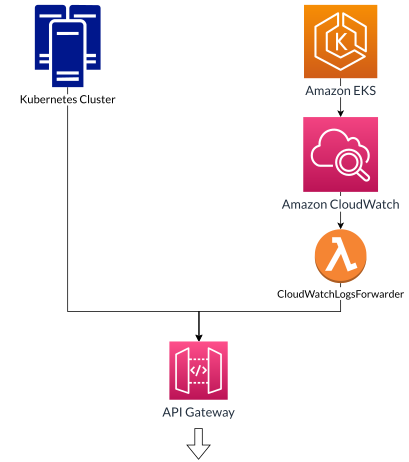

</br>

<p align="center">
  
</p>

</br>


## 📕 Introduction

<p align="justify">
  "ARGOS - Behavioral anomaly detection within a <a href="https://kubernetes.io">Kubernetes</a> cluster" made by a group of students in their final year project at <a href="https://www.ece.fr/">École Centrale d'Électronique (ECE)</a> in Paris.
  
  This open source project was sponsored by <a href="https://aws.amazon.com/">Amazon Web Services (AWS)</a>.
  
  In cybersecurity, behavioral analysis is a threat detection technique that relies on understanding the usual behaviors of users and entities. With this understanding, we can detect subtle changes in behavior within the system that may be warning signs of malicious activity.

  AWS Machine Learning algorithms provide many easy-to-use tools for anomaly detection. <a href="https://docs.aws.amazon.com/sagemaker/latest/dg/randomcutforest.html">Random Cut Forest</a>, for example, can detect anomalous points in a vector space of arbitrary dimension.
  
  ARGOS is an open-source tool based on Machine Learning tools provided by AWS to detect unusual behaviors within a Kubernetes cluster. These anomalies can be the sign of a Kubernetes compromise and therefore synonymous with a security breach and are thus reported to <a href="https://aws.amazon.com/security-hub/">AWS SecurityHub</a>.

</p>
</br>

## 🏢 ☁️ Kubernetes Cluster source


</br>
<p align="center">
  
</p>
<p align="center">
  
</p>

</br>

ARGOS can be used for any Kubernetes cluster. During the development phase, we used an <a href="https://aws.amazon.com/eks/">EKS</a> cluster. An <a href="https://aws.amazon.com/api-gateway/">API Gateway</a> is there to provide the bridge between the cluster and our solution.

For an EKS cluster, the logs are sent natively to <a href="https://aws.amazon.com/cloudwatch/">Amazon CloudWatch</a>, so we implemented a <a href="https://aws.amazon.com/lambda/">Lambda</a> function that decodes and forwards the logs to API Gateway.

</br>


## 🏛️ Architecture of ARGOS


<p align="center">
  
</p>

</br>

## ⬇️ Downloading ARGOS


The latest stable version of ARGOS will always be the stable branch of the GitHub repository. You can get the latest version of the code using the following command:

```shell
git clone https://github.com/GodZer/PFE-ARGOS.git
```

</br>

## ⚡️ Quickstart


* **Prerequisites:** building the solution requires the following tools to be installed on your system.
  * [NodeJS 14.x](https://nodejs.org/en/download/)
  * [AWS Command Line Interface (CLI)](https://aws.amazon.com/cli/)
  * [Python 3.x](https://www.python.org/downloads/)
  * [Docker](https://docs.docker.com/get-docker/)

* To proceed the deployment of the app, please refer to the [following link](https://github.com/GodZer/PFE-ARGOS/blob/main/App/README.md)

</br>

## 👥 Contributors


<p align="justify">

  
  * Fanny MARCUCCINI
  * Sébastien JULIEN
  * Julien TERRIER
  * Rayan OULD-KACI
  * Thibault GIRARD
  * Claire THEOKRITOFF
  * Nicolas HAUSER

</p>
